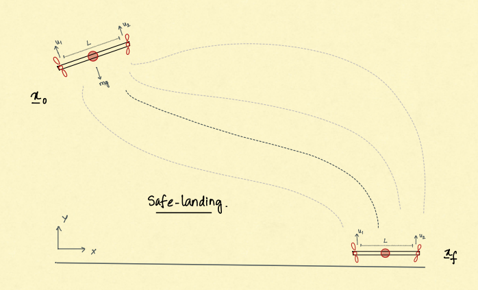
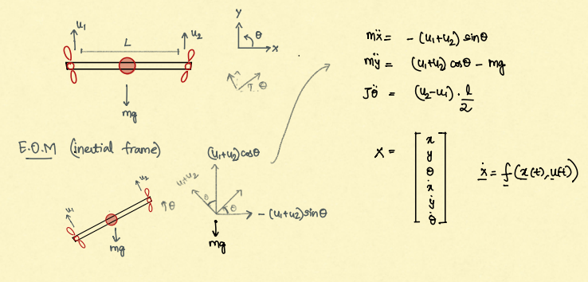
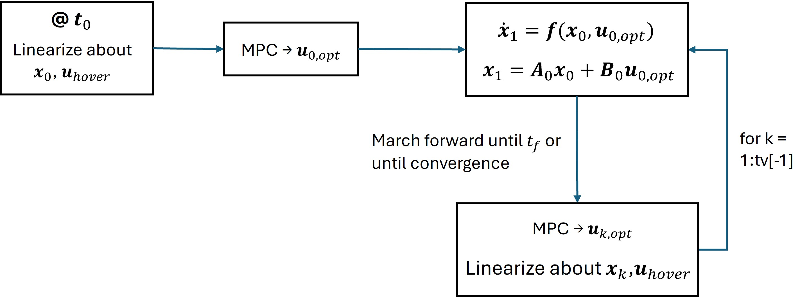
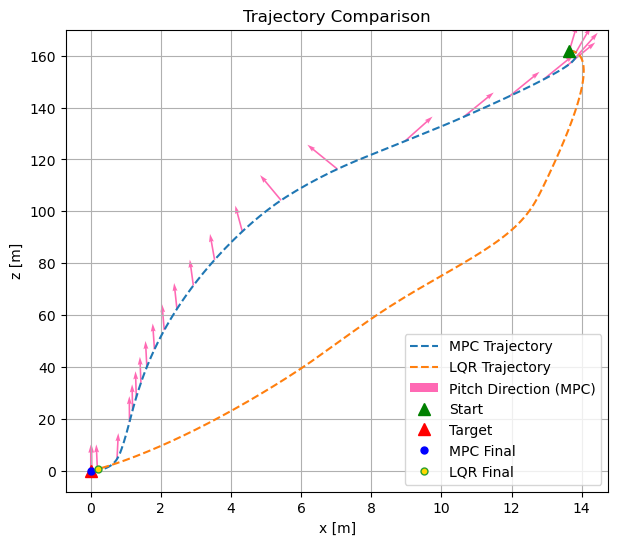

# drone-landing-MPC
Comparison of PID, LQR and MPC for drone landing problem

# 3 DoF Planar Drone Landing Problem
> Ramchander Bhaskara, PhD, Texas A&M University

## Problem Statement

The control problem is for a tandem dual-rotor system where the drone is actuated by two thrusters at both ends of a beam (chassis). The position and pitch can be controlled by controlling the thrust. 

The vehicle motion is described by only 3 Degrees of Freedom (3DoF), as follows:
-  $x$ : lateral position
-  $y$ : altitude
-  $\theta$ : attitude angle (pitch)
  

## Dynamics
Here is a drawing describing the derivation of the equations of motion: 

### Equations of motion
$$\begin{align} 
\dot{x} &= v_x  \\ 
\dot{y} &= v_y \\
\dot{\theta} &= \omega \\
\dot{v_x} &= -\frac{(u_1 + u_2)}{m} \sin(\theta) \\
\dot{v_y} &= \frac{(u_1 + u_2)}{m} \cos(\theta) - g \\
\dot{\omega} &= \frac{(u_2 - u_1)}{J} \cdot \frac{L}{2}
\end{align}$$

# MPC: Receding Horizon Control

MPC looks for optimal control law in the finite horizon (for N steps). It takes a cost minimizing step towards the goal - only for the fixed horizon. After executing the control for that step, it slides the horizon window, incorporates new information from trajectory, and computes the control towards the goal. 

## Objective Function
$$ \begin{equation} J = \frac{1}{2} (\mathbf{x}_N - \mathbf{x}_r)^T \mathbf{Q}_N (\mathbf{x}_N - \mathbf{x}_r) + \sum \frac{1}{2}(\mathbf{x}_k - \mathbf{x}_r)^T \mathbf{Q} (\mathbf{x}_k - \mathbf{x}_r) + \frac{1}{2} (\mathbf{u}_k - \mathbf{u}_r)^T \mathbf{R} (\mathbf{u}_k - \mathbf{u}_r) 
\end{equation}$$ 
 

The penalty on terminal states, deviation from nominal trajectory and control is a convex optimization problem solved using quadratic programming. Solver used: OSQP. 

## MPC implementation

# Results 

See the notebook for results on individual states as well as tuning parameters.

# Notes

- Needed to constrain altitude $z \geq 0$ all the times as the landing is above the ground - requires optimization toolbox for inequality constraints.
- Linearization is tricky - choosing to linearize at hovering initial state or reference state - improvise on linearizing if having a reference trajectory.
    - Linearizing at current MPC optimal control output resulted in poor control along the trajectory. This is because, for example, when high thrust is demanded by controller - it may not a linear operating point.
    - A reference trajectory could make the trajectory corrections early on in the flight $[\textcolor{blue}{\text{Future work}}]$. For instance, a straight line trajectory $\mathbf{x}_\text{ref}$ helps in regularizing cost function in the MPC horizon and precompute linearization points. 

- LQR, at times, does well with the trajectory control - however there is no formalism in adding state constraints like MPC.
    - LQR seems to leverage that additional flexibility in states to reach desired faster. For example, $y$ can be negative.
    - Also, LQR struggles to work when moved far from linear operating state & control.
    - LQR does not really seem to like very tight constraints. It buckles when tighter constraints are enforced. MPC tends to work around hard constraints. 
- MPC is a receding horizon control. Meaning - it tries to plan control for a fixed time window into the future. Taking hints from the prediction of dynamics during the window as well as the remaining cost-to-go, MPC gives locally optimal control with the hope of global optimal policy.
    - A short MPC horizon computes faster but be myopic. A long horizon is compute inefficient (matrix operations). A medium horizon planning for the control, especially guided by a planned trajectory could help achieve real-time realization of MPC optimal control onboard.
    - Furthermore, I see the MPC very sensitive to the initial conditions. The same penalties are not applicable for all initial conditions - any bad state readout will topple the MPC chain as the linearization is computed at the current state and if the current state is far from linearization (e.g., high attitude or velocities). 

### Conclusion
Control requires careful tuning of penalties in states and costs. Apart from control constraints (hardware dependent), state constraints help define the control policy for maneuvering to the landing target. Careful tuning of the penalties in states, terminal state, and control dictates the trajectory performance. Not implemented here, but using a planned trajectory $\mathbf{x}_\text{ref}$ helps MPC react to fast dynamics early on. Moreover, MPC is compute heavy and implementations such as the above, are without any convergence guarantees. However, with pre-planned trajectory, a few computations can be performed offline and efficient embedded implementation could potentially yield at $20$ Hz onboard control rate or better. 

### Resources
- [OSQP documentation](https://pypi.org/project/osqp/)
- [MPC for convex optimization](https://www.youtube.com/watch?v=7aomMyPHKwI&t=3710s&ab_channel=CMURoboticExplorationLab)
- [MPC Quadratic Programming](https://www.youtube.com/watch?v=mVCjzMtj7yE&ab_channel=xLABforSafeAutonomousSystems)

